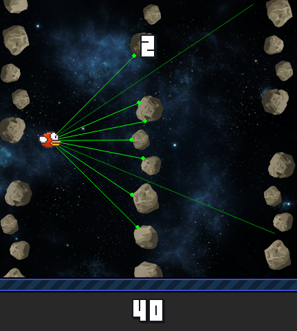

Forked from: https://github.com/JohsBL/flappy_automation_test

# Flappy Bird Automation Game

This repository contains the Flappy Bird game modified to be controlled with ROS.

## Game Description

Flappy Bird is in trouble again! This time it went into space and landed in an asteroid belt. If Flappy Bird collides with the asteroids it would be fatal. Luckily Flappy remembered his laser scanner that provides distance measurements. It will give you its velocity and the laserscans in return for an acceleration input. Flappy Bird only asks for 60 seconds of your guidance. Help Flappy Bird go through as many asteroid lines as possible before the time runs out!     



## Getting Started

*This game has been tested with Ubuntu 16.04 running ROS Kinetic and Python 2.7.*   

There are two recommended options for running the game. Either download the VirtualBox image that comes with a complete Ubuntu 16.04 setup or add the packages provided from this repository to your own ROS workspace.    

### Option 1 - VirtualBox
First download VirtualBox from here [[VirtualBox link]](https://www.virtualbox.org/wiki/Downloads) and install it on your system. Then download the Ubuntu image that we have preconfigured with ROS and the game from here [[Image link]](https://drive.google.com/file/d/1qDaW2qVh9BTEdVVVM2RKJ4msuvuQTQ9j/view). Once downloaded add the image to VirtualBox and boot up Ubuntu.
The username and password are both **FlyaTest** .  
Be sure to pull the latest version of the code from github before you begin!

### Option 2 - Adding as ROS package  
If you already have Ubuntu you can install ROS and setup a workspace as covered here [[ROS install guide]](http://wiki.ros.org/ROS/Tutorials/InstallingandConfiguringROSEnvironment).  
To add the automation game to your workspace clone the automation game repository to the source folder.

If you followed the ROS installation tutorial it will look like this,   
```
cd ~/catkin_ws/src/
```
Clone the automation game,
```
git clone https://github.com/JohsBL/flappy_automation_test.git
```
Make sure you have Pygame installed,
```
sudo apt-get install python-pygame
```

Then run the catkin_make command
```
cd ~/catkin_ws/
catkin_make
```

## Run The Game

To run the game we use the roslaunch command. There are two ROS launch files depending on if you want to run the game with C++ or python automation code (whatever you prefer).

For python open a terminal and run,
```
roslaunch flappy_automation_code flappy_automation_code_py.launch
```
For C++ open a terminal and run,
```
roslaunch flappy_automation_code flappy_automation_code_cpp.launch
```
A GUI will become visible with the game start screen. For now the automation code does not do anything other than printing out some laser ray information. To start the game and move the bird press the arrow keys. Tapping the up key &uarr; will start the game. You can then add velocity in a wanted direction by pressing the arrow keys &larr;&uarr;&darr;&rarr;. Notice that it is not possible to go backwards and if hitting an obstacle the game stops.

## Automate Flappy Bird
Now that we have gotten familiar with the game we want to control Flappy Bird. To do this a python and C++ template has been provided. 

### Modifying the code
The templates are located in the **flappy_automation_code** folder. Be aware that you are not meant to change the files in **flappy_main_game**.         

For using python modify the file **flappy_automation_code_node.py** in the **scripts** folder.  

For using C++ modify the files **flappy_automation_code.cpp** in the **src** folder and **flappy_automation_code.hpp** in the **include** folder.

Take your pick.

To get the state of the bird velocity readings and laserscans are published and an acceleration command can be given for actuating the Flappy Bird. Callbacks for these topics and examples of how to read the returned messages is provided in the code.

### Build and run
Once the code has been modified run the catkin_make command again,
```
cd ~/catkin_ws/
catkin_make
```

Then launch the game as before.

For Python,
```
roslaunch flappy_automation_code flappy_automation_code_py.launch
```
For C++,
```
roslaunch flappy_automation_code flappy_automation_code_cpp.launch
```

## Handing In
To hand in the game solution please send the relevant files (the ones you changed) in a ZIP file by email.   

## Other Information
I hope you will have fun solving this little game. If you have any questions or need other game information either write me or look around in the **flappy_main_game** folder. Here is some other helpful information for solving the task.

Scaling: 1 pixel = 0.01 meter  
Game and sensor update rates: 30 fps   
The velocity measurement is noise free   
Max acceleration x: 3.0 m/s^2  
Max acceleration y: 35.0 m/s^2  
Axis convention: x &rarr;, y &uarr;  
[LaserScan message definition](http://docs.ros.org/api/sensor_msgs/html/msg/LaserScan.html)

| Value        | Unit           | Topic  |
| ------------- |:-------------:| :-----:|
| Velocity      | m/s           | /flappy_vel |
| Acceleration  | m/s^2         | /flappy_acc |
| LaserScan     | Radians, meters      | /flappy_laser_scan |
